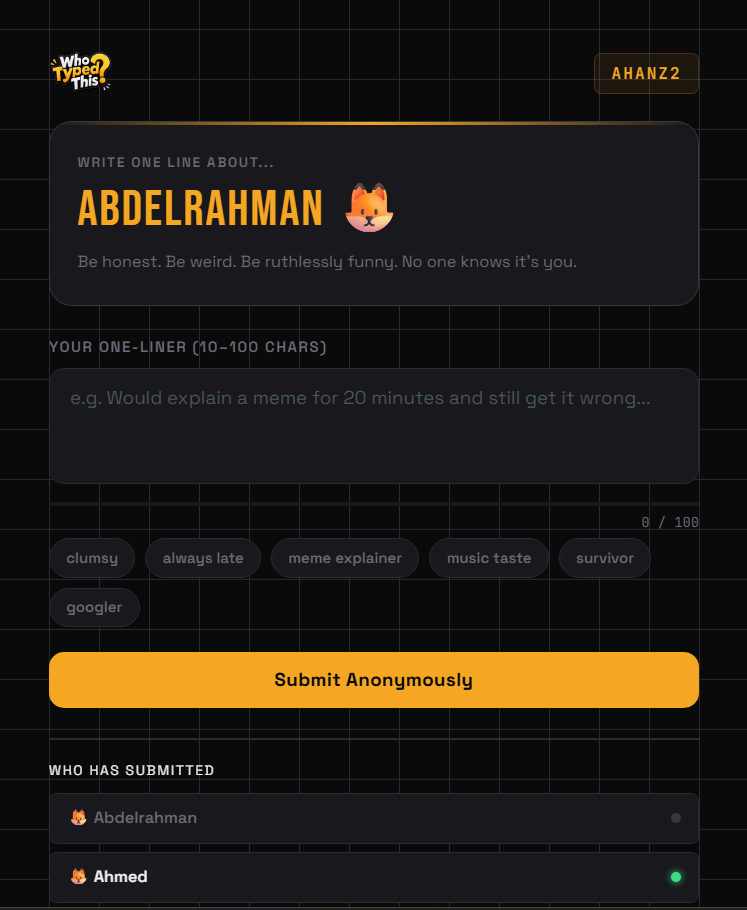
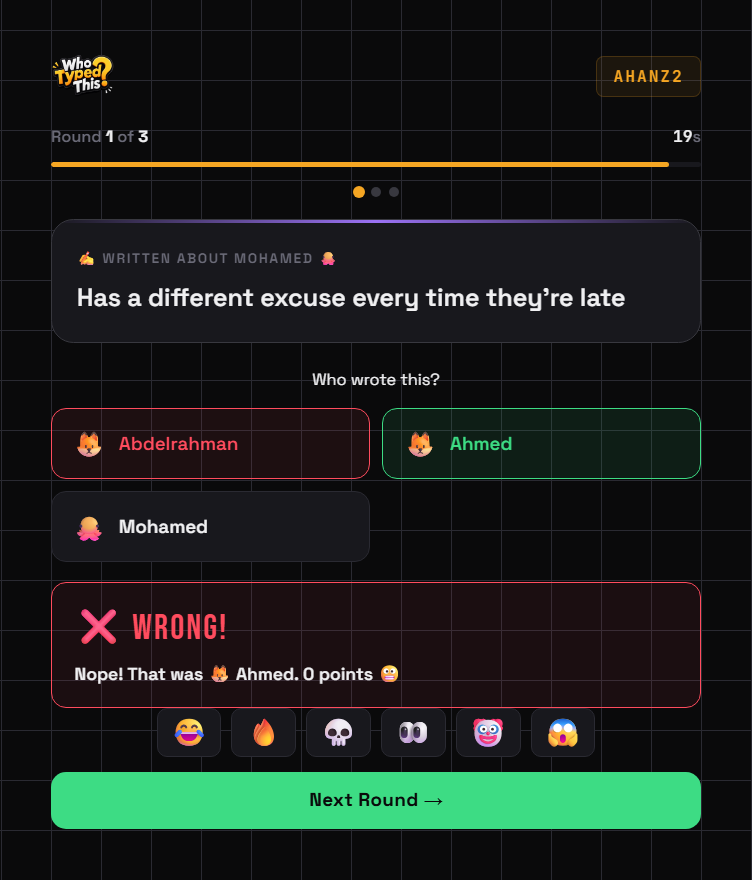
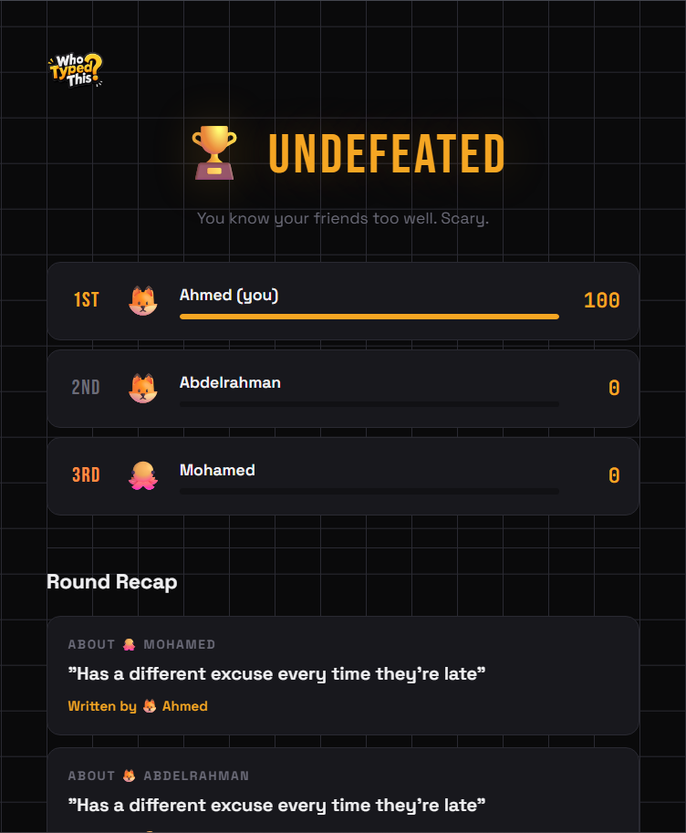

<p align="center">
    
</p>

# 🎭 Who Typed This? beautiful friends game.

### *The multiplayer game that destroys friendships professionally.*
<p align="center">
  
  
</p>

---
## What is this?
**WhoTypedThis?** is a multiplayer browser game where: 

1. Someone types a message anonymously 👀
2. Everyone tries to guess who typed it 😭
3. Trust disappears forever 💀

It's basically: 

* 20% typing
* 30% detective work
* 50% accusing your innocent friends

---

## Gameplay
#### Example Round

> “I still use Internet Explorer.”

And suddenly: 

* Ahmed is screaming
* Sarah is offended
* Someone votes randomly
* One player disconnects emotionally

Perfect.

## **Features**
### Anonymous Messages

Type anything.
Absolutely anything.

(Within reason. We are watching.)


### Multiplayer Rooms 

Create rooms instantly and invite friends.

Or enemies.
Both work.


### Fast-paced rounds

Quick rounds.
Instant chaos.
No time to think.
Only panic.

### Pschological warfare
You think you know your friends.
You don't.


### Leaderboard System

Earn points by: 
* Guessing correctly
* Fooling everyone
* Beinf suspiciously good at lying


### Funny moments
Not technically a feature
But it happens every 7 seconds. 

---
## **Screenshots**

| Create Room | Game Room |
|---|---|
|  |  |

| Write Prompt |
|---|
|  |

| Choose The Writer | Scoreboard |
|---|---|
|  |  |

---
## **Tech Stack**

Built using the ancient forbidden technologies:

```txt
HTML
CSS
JavaScript
```
---

## **Installation**
You can play it at: 
or clone the project: 

```bash 
git clone https://github.com/abdelrahman-mo7amd/WhoTypedThis.git
```

Open it: 
```bash
cd whotypedthis
```

Run it: 
```bash
open index.html
```
Or double click it like a civilized human.

---

## **Why this game exists**

Because normal party games are too peaceful
We needed:
* more accusations
* more confusion
* more screaming in voice chat 

So this happend.


## **Planned Features for Next Version**
* [ ] Customs avatars
* [ ] Accounts
* [ ] Friend lists and requests
* [ ] "Most suspicious player" badge
* [ ] Therapy support after matches


## Contributing
Want to contribute?

Cool.

Just remember: 
if you add bugs, 
we'll pretent they're features.

## Support 
If this game made your friends accuse each other unfairly: 
⭐ Star the repository.
It feeds the developer emotionally.


## 📜 License

MIT License

Meaning:
you can use it,
modify it,
and probably create even more chaos.


<p align="center">
  <b>WhoTypedThis?</b><br>
  Guess. Laugh. Regret.
</p>