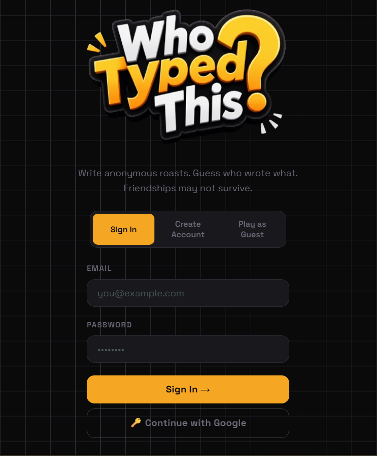
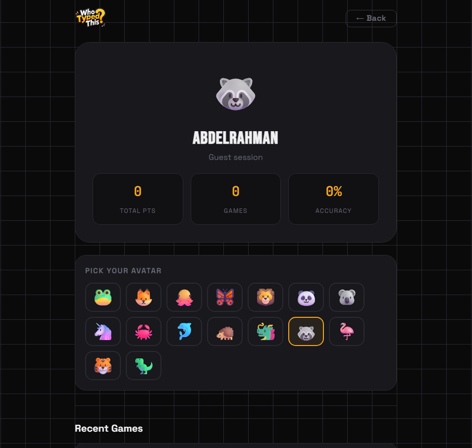
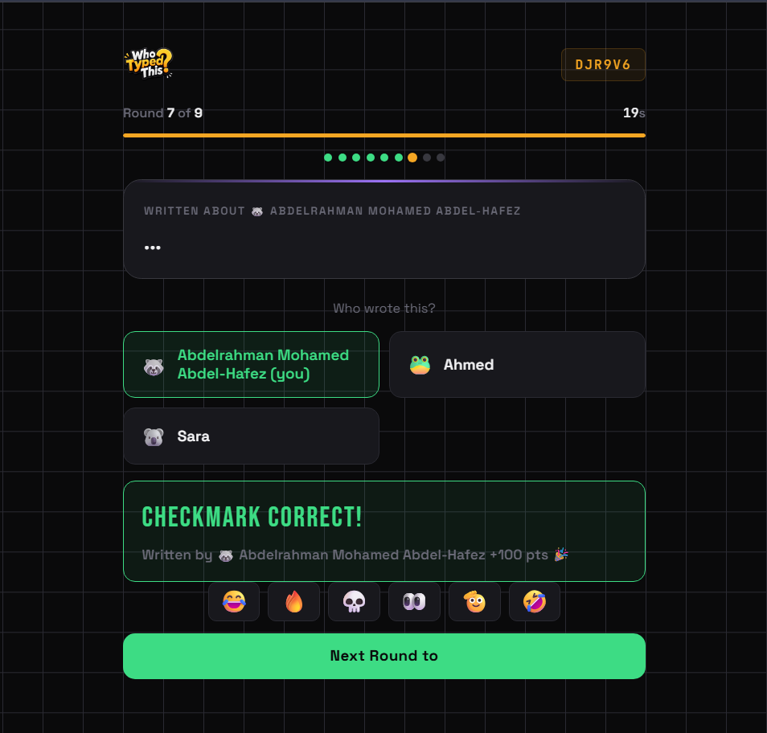
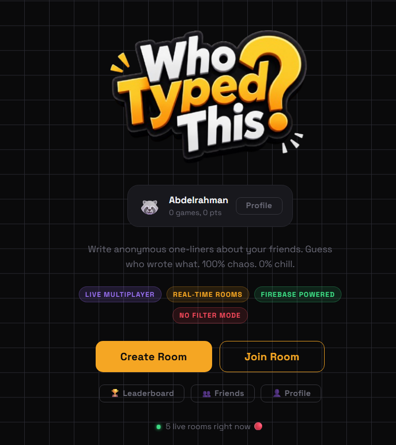

<p align="center">
    
</p>

# 🎭 Who Typed This? v2.0 is alive and making friendships questionable
<p align="center">
  
  
</p>

### A real-time multiplayer typing game where friends compete, lie, and slowly lose trust in each other.

Live demo: [https://whotypedthis-f9704.web.app/](https://whotypedthis-f9704.web.app/)

---

## How it works

1. Someone types a message anonymously
2. Everyone tries to guess who wrote it
3. Accusations begin immediately, usually wrong
4. Relationships are temporarily tested
5. Repeat until someone logs off “for no reason”

---

## Gameplay example

> “I still use Internet Explorer.”

What happens next:

* Ahmed denies everything too aggressively
* Sarah takes it personally
* Someone votes based on vibes
* One player suddenly becomes silent for the rest of the match

This is normal behavior.

---

## Features

### Anonymous chaos generator

Type anything. Seriously.
(Within the boundaries of whatever your friends will forgive you for.)

### Multiplayer rooms

Create a room, invite friends, or accidentally invite enemies.
Both lead to the same outcome.

### Firebase-powered reality

* Authentication via Firebase Auth
* Real-time syncing with Firestore
* Live updates faster than your friendships recover

### Fast-paced rounds

No time to think.
Only panic and questionable decisions.

### Psychological warfare module

You think you know your friends.
You don’t.

### Leaderboard system

Earn points by:

* Guessing correctly (rare skill)
* Convincing everyone you didn’t type that (art form)
* Acting suspicious for no reason (natural talent)

### Funny moments

Not officially a feature.
Still happens constantly.

---

## Screenshots

| Signin/Signup/Guest Page  | Create / Join Room          |
| ----------------------- | --------------------------- |
|  |  |

|  Profile                 | Room Lobby             |
| --------------------------- | -------------------------- |
|  |  |

| Write Prompt                 | Voting Phase                 |
| ---------------------------- | ---------------------------- |
|  |  |

| Scores and Results           |  Home                 |
| -------------------------- | ------------------------------- |
|  |  |

---

## Tech stack

* Frontend: Vanilla JS, HTML, CSS
* Backend: Firebase

  * Firestore (real-time brain damage sync)
  * Authentication (who even are you?)
  * Hosting (so others can suffer too)
* Realtime engine: Firestore listeners (`onSnapshot`)
* Deployment: Firebase Hosting

---

## Project structure

```
.
├── assets/
├── css/
├── js/
├── index.html
├── firebase.json
├── firestore.rules
└── README.md
```

---

## How to play

1. Open the game
2. Sign in, sign up, or enter as guest (identity is optional here)
3. Create or join a room
4. Wait for players (or victims)
5. Start round
6. Everyone submits something suspicious
7. Everyone votes emotionally
8. Score is calculated scientifically (not really)

---

## Installation

Clone the repo:

```bash
git clone https://github.com/abdelrahman-mo7amd/WhoTypedThis.git
cd WhoTypedThis
```

---

## Firebase setup

Create a Firebase project and enable:

* Firestore Database
* Authentication
* Hosting (optional, but recommended if you enjoy public chaos)

Add config to `firebase.js`:

```js
const firebaseConfig = {
  apiKey: "YOUR_API_KEY",
  authDomain: "YOUR_PROJECT.firebaseapp.com",
  projectId: "YOUR_PROJECT_ID",
  storageBucket: "YOUR_BUCKET",
  messagingSenderId: "XXXX",
  appId: "XXXX"
};
```

---

## Run locally

```bash
python3 -m http.server 8080
```

or

```bash
firebase emulators:start --only hosting
```

---

## Deploy

Full deploy:

```bash
firebase deploy
```

Hosting only:

```bash
firebase deploy --only hosting
```

Firestore only:

```bash
firebase deploy --only firestore
```

---

## Architecture

* Firestore is the real-time brain
* Each room is a live experiment
* Players are data points with opinions
* `onSnapshot()` keeps everything synchronized and slightly unpredictable

---

## Contributing

If you want to contribute:

1. Fork it
2. Break something
3. Fix it
4. Submit a PR explaining why it broke in the first place

---

## License

MIT License

Meaning:
you can use it,
modify it,
and probably create even more chaos.


<p align="center">
  <b>WhoTypedThis?</b><br>
  Guess. Laugh. Regret.
</p>
